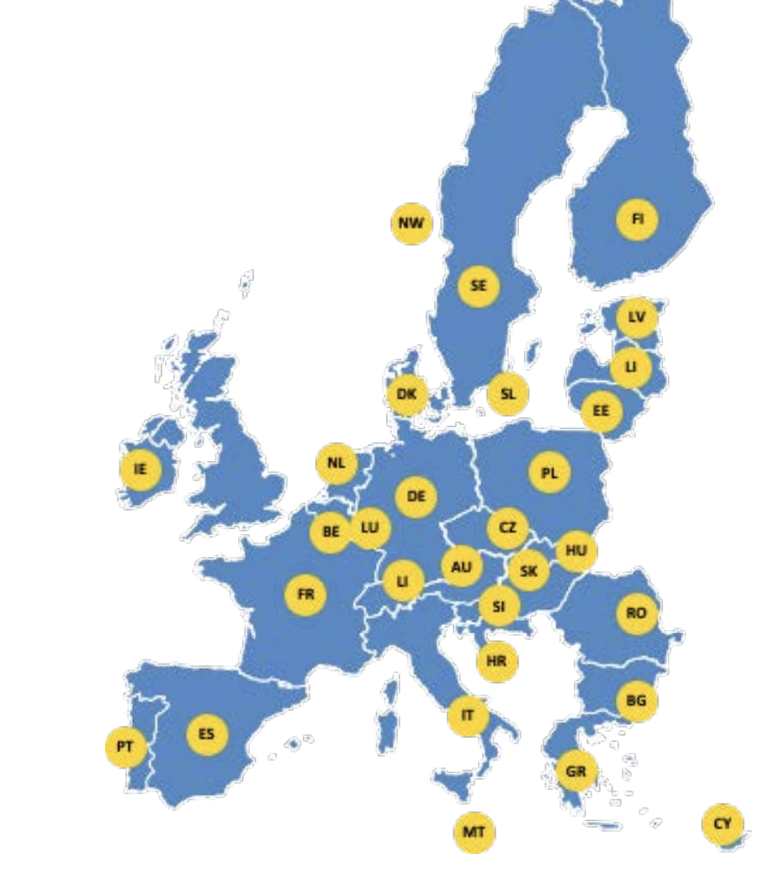
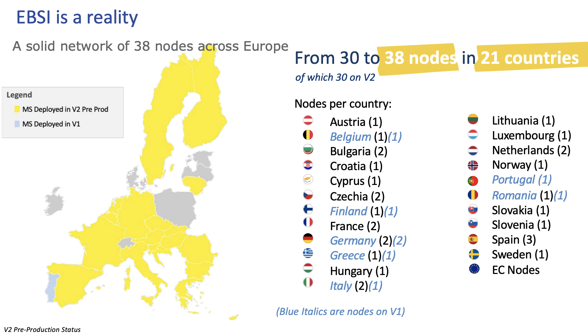

# EuroBlock Consult Lightpaper

To purpose solutions to blockchain entrepreneurs, we have to give right questions for entrepreneurs.

[Slides of the project](./docs/EuroBlock_Consult.pdf)

**Context** : I have a project in blockchain which involves compliance or KYC. For example real estate tokenisation. You want that your project fits with European regulation. 
As a long term vision project leader, you want to build on the next european standard. 

## What is EBSI ? What is the Blockchain European structure ?

European Union built in 2018, (find initial partnerships), European Blockchain Partnership (EBP) in order to manage and give a voice at every members about European Blockchain Projects.

**Board and members**

EBP has fastly propose to build a Blockchain Infrastructure available for every member countries. This is named EBSI (European Blockchain Service Infrastructure). It provides : nodes, blockchains and services which can be needed to deploy projects.

Technically, EBSI is running under [Hyperledger](https://www.hyperledger.org/) with more than 40 nodes already deployed in Europe. 

Basically there are two blockchains : one permissioned decentralised and one private. 
Our main focus today will be on permissioned one because of DID (Decentralised european ID) will be available on it.

## How to move the project on EBSI ?

For now, EBSI is still in development. All features are not yet available and public institutions are implementing Digital European IDentity day to day. 
As the web3 ecosystem, the EU tools are still under development. 

*Remark* : Solidity is still in version v0.8.21 ! Still not the v1 ! Not be too impatient.

One of the easiest way to move on EBSI soon is to integrate actual funded projects. 
There are tools already available in Open-Source [Github funded projects]().

## Can I have grants to move on EBSI ?

For now grants to integrate EBSI technology are closed until european elections but it can be re opened after 

